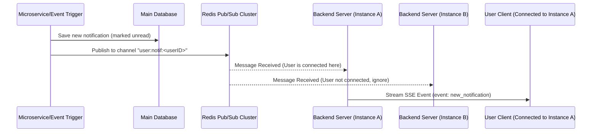

# Stage 1

## REST API Design & Real-Time Sync Strategy for Client Notifications

Hey, here's the API design and real-time communication contract for the user notification center. Since we are integrating this into the dashboard and backend services of our workspace, I’ve kept the endpoints as lean as possible while still ensuring we can support infinite scroll/pagination and badge counts.

---

### 1. Key API Actions (User-Facing)

The notification hub will support five primary actions for a logged-in user:
1. **Fetch Notifications**: Paginated feed. We will support filtering by read status (`unread`, `read`, or `all`) and categories to keep the UI clean.
2. **Get Unread Count**: A lightweight call to update the header badge count without pulling the whole payload.
3. **Mark Read**: Accepts an array of IDs to support bulk actions (e.g., checking off multiple items).
4. **Mark All Read**: Quick catch-up action.
5. **Dismiss/Delete**: Hides or hard-deletes a notification from the user's feed.

---

### 2. API Endpoint Specification (Base URI: `/api/v1`)

All endpoints require JWT authorization in the header.

#### Request & Response Headers
- `Authorization: Bearer <token>` (Required)
- `Content-Type: application/json` (Required for write operations)
- `X-Request-ID: <uuid>` (Optional, but highly recommended for trace matching between FE logs and backend gateway)

---

#### 2.1 GET `/api/v1/notifications` (Feed Retrieval)

**Query Parameters:**
- `page` (integer, default `1`)
- `limit` (integer, default `15`)
- `filter` (string: `unread` | `read` | `all`, default `all`)
- `category` (string, optional: `billing`, `security`, `social`)

**Success Response (200 OK):**
```json
{
  "success": true,
  "data": [
    {
      "id": "notif_770a1c22-df38-4e89-b291-766a0123ef21",
      "title": "System Alert",
      "body": "Your logging-middleware package has been successfully deployed.",
      "category": "security",
      "urgency": "high",
      "isRead": false,
      "metadata": {
        "repo": "Lavakumar-Gedala/A23126510142",
        "actionUrl": "/deployments/33421",
        "actor": "GitHub Actions CI"
      },
      "createdAt": "2026-06-23T11:46:12Z",
      "readAt": null
    }
  ],
  "meta": {
    "currentPage": 1,
    "limit": 15,
    "totalCount": 42,
    "totalPages": 3,
    "hasNext": true
  }
}
```

---

#### 2.2 GET `/api/v1/notifications/unread-count` (Badge Count)

**Success Response (200 OK):**
```json
{
  "success": true,
  "count": 9
}
```

---

#### 2.3 PATCH `/api/v1/notifications/read` (Mark Specific Notifications Read)

Allows passing multiple IDs at once (useful if user scrolls past notifications or ticks multiple checkboxes).

**Request Body:**
```json
{
  "ids": [
    "notif_770a1c22-df38-4e89-b291-766a0123ef21"
  ]
}
```

**Success Response (200 OK):**
```json
{
  "success": true,
  "updatedIds": [
    "notif_770a1c22-df38-4e89-b291-766a0123ef21"
  ]
}
```

---

#### 2.4 POST `/api/v1/notifications/read-all` (Clear All Unread)

**Success Response (200 OK):**
```json
{
  "success": true,
  "message": "All active notifications marked as read."
}
```

---

#### 2.5 DELETE `/api/v1/notifications/:id` (Dismiss Notification)

**Success Response (200 OK):**
```json
{
  "success": true,
  "dismissedId": "notif_770a1c22-df38-4e89-b291-766a0123ef21"
}
```

---

### 3. API Contract Schema Definition (JSON Schema format)

These schemas ensure payload integrity. We can plug these directly into our Express/Fastify validation middleware.

#### 3.1 Feed Response Validation Schema
```json
{
  "$schema": "http://json-schema.org/draft-07/schema#",
  "type": "object",
  "required": ["success", "data", "meta"],
  "properties": {
    "success": { "type": "boolean" },
    "data": {
      "type": "array",
      "items": {
        "type": "object",
        "required": ["id", "title", "body", "category", "urgency", "isRead", "createdAt"],
        "properties": {
          "id": { "type": "string", "pattern": "^notif_[a-f0-9\\-]{36}$" },
          "title": { "type": "string", "maxLength": 100 },
          "body": { "type": "string", "maxLength": 500 },
          "category": { "type": "string" },
          "urgency": { "type": "string", "enum": ["low", "high"] },
          "isRead": { "type": "boolean" },
          "metadata": { "type": "object", "additionalProperties": true },
          "createdAt": { "type": "string", "format": "date-time" },
          "readAt": { "type": ["string", "null"], "format": "date-time" }
        }
      }
    },
    "meta": {
      "type": "object",
      "required": ["currentPage", "limit", "totalCount", "totalPages", "hasNext"],
      "properties": {
        "currentPage": { "type": "integer" },
        "limit": { "type": "integer" },
        "totalCount": { "type": "integer" },
        "totalPages": { "type": "integer" },
        "hasNext": { "type": "boolean" }
      }
    }
  }
}
```

---

### 4. Real-Time Push Mechanism (Server-Sent Events)

For the frontend dashboard real-time stream, we will use **Server-Sent Events (SSE)** instead of WebSockets. 

#### Why SSE for this project?
- **HTTP/2 Native**: We're already running HTTP services; SSE doesn't require protocol upgrades or connection hijacking like WebSockets.
- **Unidirectional**: The client only needs to listen for new notifications or state synchronizations. Regular HTTP endpoints (`PATCH`, `DELETE`) are cleaner for client actions than routing custom messages through a WS frame.
- **Robust Auto-Reconnect**: Browser `EventSource` automatically handles socket disconnection, back-off retries, and passes the `Last-Event-ID` header so our backend can catch up the client on missed notifications.

#### 4.1 Connection Setup
- **Endpoint**: `GET /api/v1/notifications/stream`
- **Headers**:
  - `Accept: text/event-stream`
  - `Cache-Control: no-cache`
  - `Connection: keep-alive`
- **Auth Note**: Since the native JS `EventSource` API doesn't support custom headers, we will authenticate via a transient, single-use query parameter token (`?auth_token=JWT`) or HTTP-only cookies.

#### 4.2 Stream Contract (Event Streams)

##### Event: `new_notification`
When a service triggers a new notification, the backend streams it directly to the active browser context:
```http
event: new_notification
id: seq_998271
data: {"id":"notif_770a1c22-df38-4e89-b291-766a0123ef21","title":"System Alert","body":"Your logging-middleware package has been successfully deployed.","category":"security","urgency":"high","isRead":false,"createdAt":"2026-06-23T11:46:12Z"}
```

##### Event: `status_synced` (Multi-tab read synchronization)
If the user marks notifications read in Tab A, we broadcast this to keep Tab B updated:
```http
event: status_synced
id: seq_998272
data: {"ids":["notif_770a1c22-df38-4e89-b291-766a0123ef21"],"isRead":true}
```

##### Heartbeat (Keep-Alive)
Sent every 25 seconds to keep the socket alive through firewalls/reverse proxies:
```http
: ping
```

---

### 5. Multi-Instance Backend Distribution (Redis Pub/Sub)

If our backend scales horizontally, users will connect to different backend nodes. We'll use a Redis Pub/Sub backplane to distribute notification broadcasts.



This sequence prevents single points of connection lookup failure and ensures that no matter which Node instance the client is pinned to via Sticky Sessions or standard round-robin routing, they'll receive their notifications instantly.

